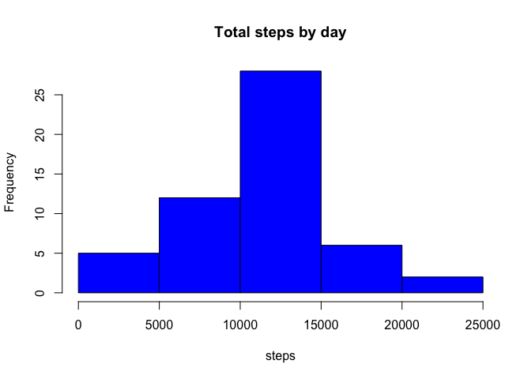
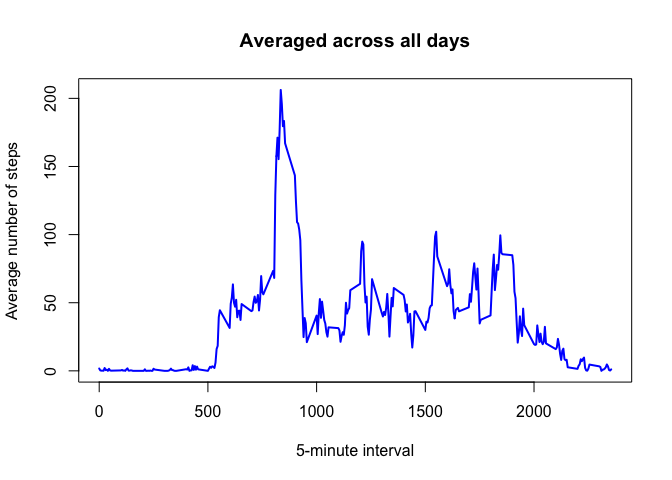
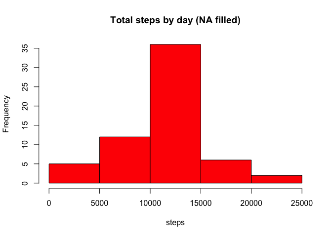
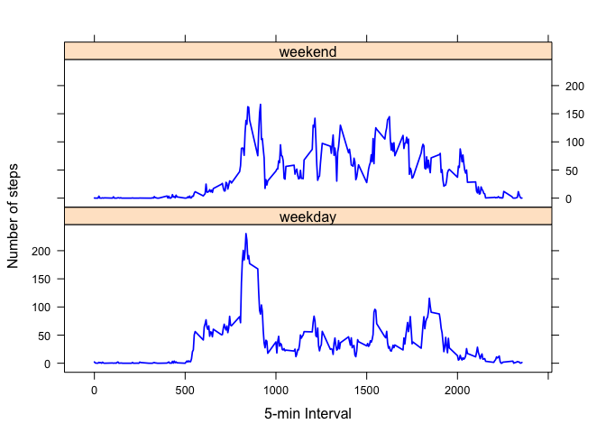

# Reproducible Research: Peer Assessment 1

## Introduction 
It is now possible to collect a large amount of data about personal movement using activity monitoring devices such as a Fitbit, Nike Fuelband, or Jawbone Up. These type of devices are part of the "quantified self" movement - a group of enthusiasts who take measurements about themselves regularly to improve their health, to find patterns in their behavior, or because they are tech geeks. But these data remain under-utilized both because the raw data are hard to obtain and there is a lack of statistical methods and software for processing and interpreting the data.

This assignment makes use of data from a personal activity monitoring device. This device collects data at 5 minute intervals through out the day. The data consists of two months of data from an anonymous individual collected during the months of October and November, 2012 and include the number of steps taken in 5 minute intervals each day.

The data for this assignment can be downloaded from the course web site:

Dataset: [Activity monitoring data](https://d396qusza40orc.cloudfront.net/repdata%2Fdata%2Factivity.zip) [52k]
The variables included in this dataset are:

 + **steps**: Number of steps taking in a 5-minute interval (missing values are coded as NA)

 + **date**: The date on which the measurement was taken in YYYY-MM-DD format

 + **interval**: Identifier for the 5-minute interval in which measurement was taken

The dataset is stored in a comma-separated-value (CSV) file and there are a total of 17,568 observations in this dataset.

## Loading and preprocessing the data

```r
setwd('/Users/fengw/study/datasciencecoursera/RepData_PeerAssessment1')
infile <- "activity.csv"
inData = read.csv(infile)
head(inData,5)
```

```
##   steps       date interval
## 1    NA 2012-10-01        0
## 2    NA 2012-10-01        5
## 3    NA 2012-10-01       10
## 4    NA 2012-10-01       15
## 5    NA 2012-10-01       20
```

## What is mean total number of steps taken per day?

```r
inData$date <- as.Date(inData$date, "%Y-%m-%d")
totalStepPerDay <- aggregate(steps~date,inData,sum,na.rm=T)
hist(totalStepPerDay$steps,col='blue',main="Total steps by day", xlab='steps')
```



```r
meanTotalStepPerDay <- mean(totalStepPerDay$steps,na.rm=T)
medianTotalStepPerDay <- median(totalStepPerDay$steps, na.rm=T)
cat("Mean total steps per day is", meanTotalStepPerDay,'\n')
```

```
## Mean total steps per day is 10766.19
```

```r
cat("Median total steps per day is", medianTotalStepPerDay,'\n')
```

```
## Median total steps per day is 10765
```

## What is the average daily activity pattern?

```r
averagedStepPer5min <- aggregate(steps~interval,inData,mean,na.rm=T)
uniqueInterval <- unique(inData$interval)
plot(uniqueInterval, averagedStepPer5min$steps, type='l', col='blue', lwd=2, 
     xlab='5-minute interval', 
     ylab='Average number of steps', 
     main='Averaged across all days')
```



```r
sortedIndices = order(averagedStepPer5min$step, decreasing =T)
maxStepInterval <- uniqueInterval[sortedIndices[1]] 
cat("Maximum number of steps at ", maxStepInterval, "th 5-minute interval\n", sep="") 
```

```
## Maximum number of steps at 835th 5-minute interval
```

## Imputing missing values
The miss values are filled using the averaged steps across all days per 5-minute interval. There are some dates where no steps are available, so that the strategy of using mean steps per day to fill NAs is not stable to use.

```r
totalNAs <- sum(is.na(inData$steps))
cat("total NA in the dataset:", totalNAs,'\n') 
```

```
## total NA in the dataset: 2304
```

```r
newData <- inData
fillNA <- rep(1,nrow(inData))
for (i in 1:nrow(inData)) {
  rowContent <- inData[i, ]
  if (is.na(rowContent$steps)) {
    steps <- subset(averagedStepPer5min, interval == rowContent$interval)$steps
  } else {
    steps <- rowContent$steps
  }
  fillNA[i] <- steps
}
newData$steps <- fillNA
newTotalStepPerDay <- aggregate(steps~date,newData,sum,na.rm=T)
hist(newTotalStepPerDay$steps,col='red',main="Total steps by day (NA filled)", xlab='steps')
```



```r
newMeanTotalStepPerDay <- mean(newTotalStepPerDay$steps,na.rm=T) 
newMedianTotalStepPerDay <- median(newTotalStepPerDay$steps, na.rm=T) 
cat("NA filled mean total steps per day is", newMeanTotalStepPerDay,'\n')
```

```
## NA filled mean total steps per day is 10766.19
```

```r
cat("NA filled median total steps per day is", newMedianTotalStepPerDay,'\n')
```

```
## NA filled median total steps per day is 10766.19
```
After NAs filling, the mean is the same but the median is a little bit different. 

## Are there differences in activity patterns between weekdays and weekends?

```r
weekDate = weekdays(newData$date)
newData$weekDate = weekDate
 
weekdayString = c("Monday","Tuesday","Wednesday","Thursday","Friday")
weekendString = c("Saturday", "Sunday")

newData$weekDate[weekDate %in% weekdayString] = "weekday"
newData$weekDate[weekDate %in% weekendString] = "weekend"

stepsByDay <- aggregate(steps ~ interval + weekDate, newData, mean)
names(stepsByDay) <- c("interval", "weekfactor", "steps")

library(lattice)
xyplot(steps ~ interval | weekfactor, stepsByDay, type = "l", lwd=1.7, col='blue', layout = c(1, 2), 
       xlab = "5-min Interval", ylab = "Number of steps")
```




